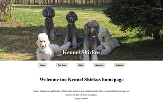

# Project Exam 1



A blog website for kennelShirkus

## Description

A project to put into practice the skills learned over my first year of studies.

A blog where owners of a kennel can create blog posts about their kennel.

- Lates post carousel.
- Blogposts filtered into "puppies" "shows" "all posts".
- Info page for each dog they own.
- using wordPress as API, fetching blog posts
- Contact page with JavaScript for validation, and error messages if the values in the textboxes do not meet the requirements.

## Built With

HTML
CSS
JS
WordPress

## Getting Started

### Installing

clone the repo and install.

1. Clone the repo:

```bash
git clone https://github.com/Noroff-FEU-Assignments/project-exam-1-IceGreenGalactic.git
```

2. Install the dependencies:

```
npm install
```

### Running

To run the app, run the following commands:

```bash
npm open index with "open with live server" or Alt+L Alt+O
```

## Contact

This is where you can leave your social links for people to contact you, such as a LinkedIn profile or Twitter link e.g.

[My LinkedIn page](www.linkedin.com/in/kristine-tyrholm-7902172a4)

## Acknowledgments

I want to express my gratitude to everyone who provided feedback and tested my website. Your insights were invaluable.

A big thanks to fellow students for sharing their experiences and wisdom during this process.

Special appreciation to those who anonymously contributed feedback through tools like Hotjar.

And heartfelt thanks to my family for their support and understanding throughout this project.
